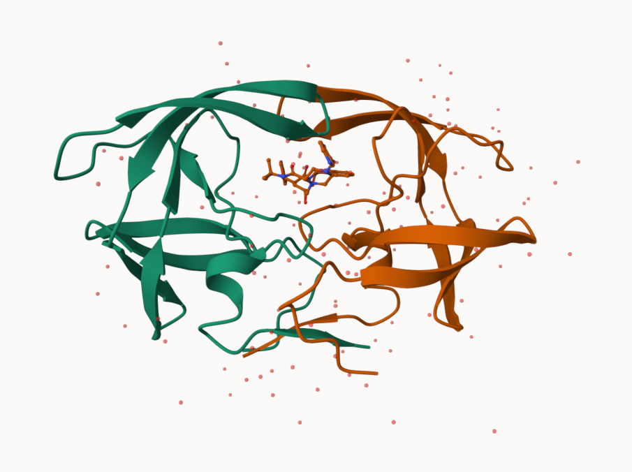
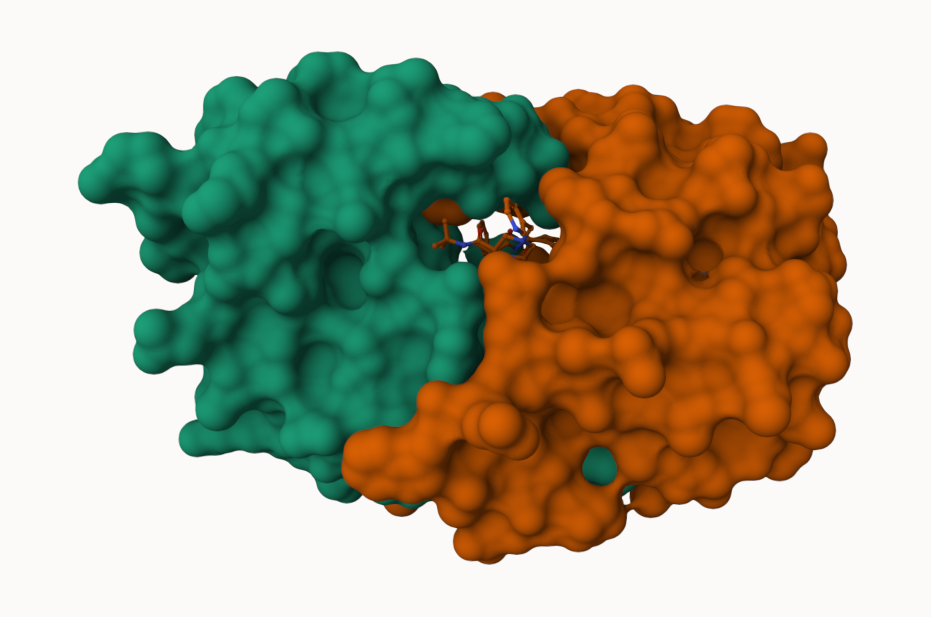
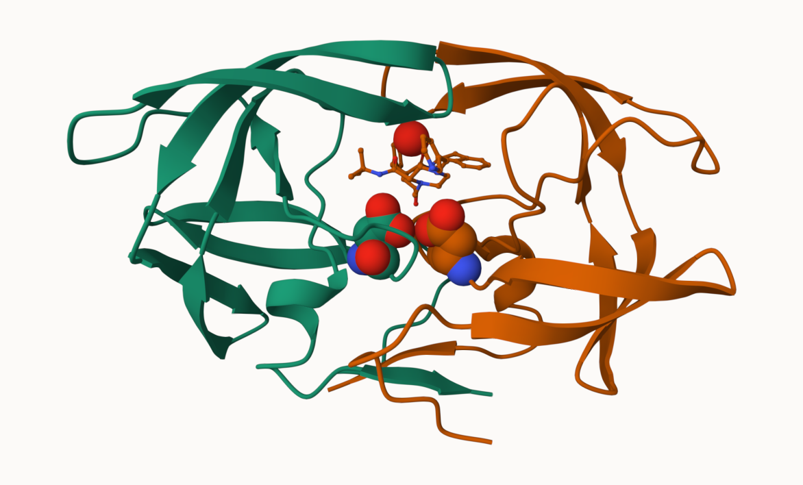

# Class 10: Structural Bioinformatics (pt1)
Linh Dang (PID: A16897764)

- [The PDB Database](#the-pdb-database)
- [2. Visualizing with Mol-star](#2-visualizing-with-mol-star)
- [3. Using the bio3d package in R](#3-using-the-bio3d-package-in-r)
- [Visualization in R](#visualization-in-r)
- [Predicting functional motions of a single
  structure](#predicting-functional-motions-of-a-single-structure)
- [4. Comparative structure analysis of Adenylate
  Kinase](#4-comparative-structure-analysis-of-adenylate-kinase)

## The PDB Database

The main repository of biomolecular structure data is called the
[Protein Data Bank](https://www.rcsb.org/) (PDB for short). It is the
second oldest database (after Genbank).

What is currently in the PDB? We can access current composition stats
[here](https://www.rcsb.org/stats)

``` r
stats <- read.csv("Data Export Summary.csv")
head(stats)
```

               Molecular.Type   X.ray     EM    NMR Multiple.methods Neutron Other
    1          Protein (only) 171,959 18,083 12,622              210      84    32
    2 Protein/Oligosaccharide  10,018  2,968     34               10       2     0
    3              Protein/NA   8,847  5,376    286                7       0     0
    4     Nucleic acid (only)   2,947    185  1,535               14       3     1
    5                   Other     170     10     33                0       0     0
    6  Oligosaccharide (only)      11      0      6                1       0     4
        Total
    1 202,990
    2  13,032
    3  14,516
    4   4,685
    5     213
    6      22

> Q1: What percentage of structures in the PDB are solved by X-Ray and
> Electron Microscopy?

``` r
as.numeric(gsub(",", "", stats$X.ray))
```

    [1] 171959  10018   8847   2947    170     11

``` r
x <- stats$X.ray

#Substitute comma for nothing
y <- gsub(",", "", x)

# convert to numeric
sum(as.numeric( y ))
```

    [1] 193952

Turn this snippet into a function so I can use it any time I have this
comma problem (i.e. the other columns of this `stats` table).

``` r
comma.sum <- function(x) {
  #Substitute comma for nothing
  y <- gsub(",", "", x)
  
  # convert to numeric and sum
  return( sum(as.numeric( y )) )
}
```

``` r
xray.sum <- comma.sum(stats$X.ray)
em.sum <- comma.sum(stats$EM)
total.sum <- comma.sum(stats$Total)
```

``` r
xray.sum/total.sum*100
```

    [1] 82.37223

``` r
em.sum/total.sum*100
```

    [1] 11.30648

> Q2: What proportion of structures in the PDB are protein?

``` r
as.numeric(gsub(",", "", stats$Total[1]))/total.sum
```

    [1] 0.862107

> Q3: Type HIV in the PDB website search box on the home page and
> determine how many HIV-1 protease structures are in the current PDB?

SKIPPED

## 2. Visualizing with Mol-star

Explore the HIV-1 protease structure with PDB code: `1HSG` Mol-star
homepage at: https://molstar.org/viewer/.







## 3. Using the bio3d package in R

The Bio3D package is focused in structural bioinformatics analysis and
allows us to read and analyze PDB (and related) data.

``` r
library(bio3d)
```

``` r
pdb <- read.pdb("1hsg")
```

      Note: Accessing on-line PDB file

``` r
pdb
```


     Call:  read.pdb(file = "1hsg")

       Total Models#: 1
         Total Atoms#: 1686,  XYZs#: 5058  Chains#: 2  (values: A B)

         Protein Atoms#: 1514  (residues/Calpha atoms#: 198)
         Nucleic acid Atoms#: 0  (residues/phosphate atoms#: 0)

         Non-protein/nucleic Atoms#: 172  (residues: 128)
         Non-protein/nucleic resid values: [ HOH (127), MK1 (1) ]

       Protein sequence:
          PQITLWQRPLVTIKIGGQLKEALLDTGADDTVLEEMSLPGRWKPKMIGGIGGFIKVRQYD
          QILIEICGHKAIGTVLVGPTPVNIIGRNLLTQIGCTLNFPQITLWQRPLVTIKIGGQLKE
          ALLDTGADDTVLEEMSLPGRWKPKMIGGIGGFIKVRQYDQILIEICGHKAIGTVLVGPTP
          VNIIGRNLLTQIGCTLNF

    + attr: atom, xyz, seqres, helix, sheet,
            calpha, remark, call

``` r
attributes(pdb)
```

    $names
    [1] "atom"   "xyz"    "seqres" "helix"  "sheet"  "calpha" "remark" "call"  

    $class
    [1] "pdb" "sse"

We can see atom with `pdb$atom`:

``` r
head(pdb$atom)
```

      type eleno elety  alt resid chain resno insert      x      y     z o     b
    1 ATOM     1     N <NA>   PRO     A     1   <NA> 29.361 39.686 5.862 1 38.10
    2 ATOM     2    CA <NA>   PRO     A     1   <NA> 30.307 38.663 5.319 1 40.62
    3 ATOM     3     C <NA>   PRO     A     1   <NA> 29.760 38.071 4.022 1 42.64
    4 ATOM     4     O <NA>   PRO     A     1   <NA> 28.600 38.302 3.676 1 43.40
    5 ATOM     5    CB <NA>   PRO     A     1   <NA> 30.508 37.541 6.342 1 37.87
    6 ATOM     6    CG <NA>   PRO     A     1   <NA> 29.296 37.591 7.162 1 38.40
      segid elesy charge
    1  <NA>     N   <NA>
    2  <NA>     C   <NA>
    3  <NA>     C   <NA>
    4  <NA>     O   <NA>
    5  <NA>     C   <NA>
    6  <NA>     C   <NA>

``` r
head( pdbseq(pdb) )
```

      1   2   3   4   5   6 
    "P" "Q" "I" "T" "L" "W" 

## Visualization in R

We can make quick 3D viz with the `view.pdb()` function:

``` r
library(bio3dview)
library(NGLVieweR)

#view.pdb(pdb, backgroundColor="pink", colorScheme="sse")
```

``` r
sel <- atom.select(pdb, resno=25)

#view.pdb(pdb, cols = c("green", "orange"),
#         highlight = sel,
#         highlight.style="spacefill") |>
#  setRock()
```

## Predicting functional motions of a single structure

We can finish off today with a bioinformatics prediction of the
functional motions of a protein.

We will run a Normal Mode Analysis (NMA)

``` r
adk <- read.pdb("6s36")
```

      Note: Accessing on-line PDB file
       PDB has ALT records, taking A only, rm.alt=TRUE

``` r
adk
```


     Call:  read.pdb(file = "6s36")

       Total Models#: 1
         Total Atoms#: 1898,  XYZs#: 5694  Chains#: 1  (values: A)

         Protein Atoms#: 1654  (residues/Calpha atoms#: 214)
         Nucleic acid Atoms#: 0  (residues/phosphate atoms#: 0)

         Non-protein/nucleic Atoms#: 244  (residues: 244)
         Non-protein/nucleic resid values: [ CL (3), HOH (238), MG (2), NA (1) ]

       Protein sequence:
          MRIILLGAPGAGKGTQAQFIMEKYGIPQISTGDMLRAAVKSGSELGKQAKDIMDAGKLVT
          DELVIALVKERIAQEDCRNGFLLDGFPRTIPQADAMKEAGINVDYVLEFDVPDELIVDKI
          VGRRVHAPSGRVYHVKFNPPKVEGKDDVTGEELTTRKDDQEETVRKRLVEYHQMTAPLIG
          YYSKEAEAGNTKYAKVDGTKPVAEVRADLEKILG

    + attr: atom, xyz, seqres, helix, sheet,
            calpha, remark, call

``` r
m <- nma(adk)
```

     Building Hessian...        Done in 0.022 seconds.
     Diagonalizing Hessian...   Done in 0.455 seconds.

``` r
plot(m)
```


``` r
#view.nma(m)
```

We can write out a trajectory of the predicted dynamics and view this in
Mol-star

``` r
mktrj(m, file="nma.pdb")
```

# 4. Comparative structure analysis of Adenylate Kinase
