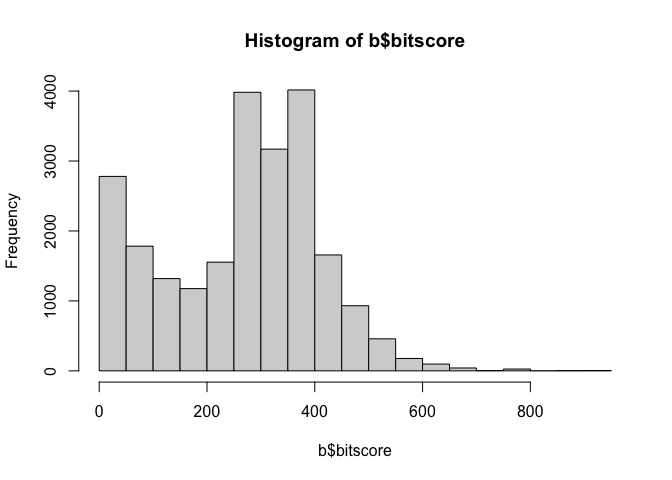
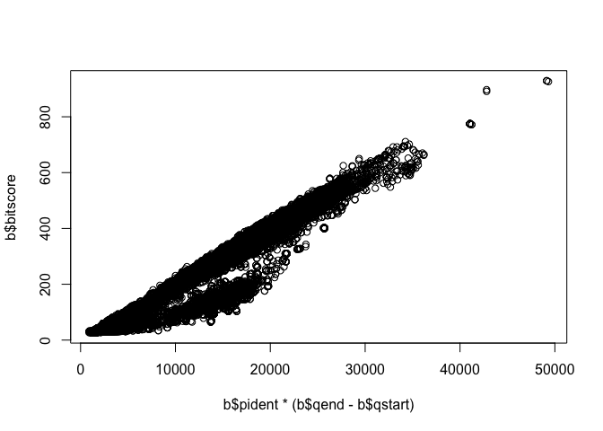
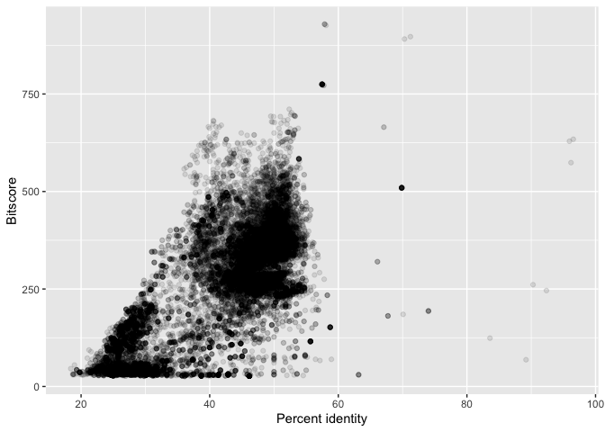
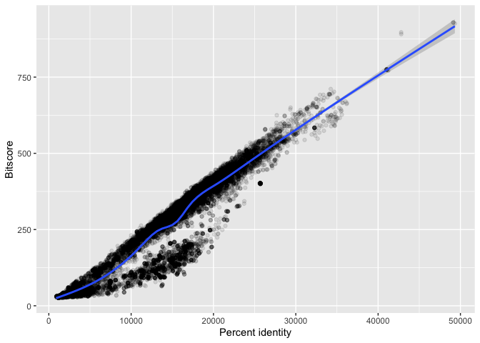

# HW16: Unix Basics
Linh Dang (PID: A16897764)

## Using RStudio locally to read my output

Import and read data that was downloaded from remote computer from
previous lab.

``` r
# Read tsv file
b <- read.table(file="results.tsv")
# Set the colnames
colnames(b) <- c("qseqid", "sseqid", "pident", "length", "mismatch", "gapopen", "qstart", "qend", "sstart", "send", "evalue", "bitscore")
head(b)
```

           qseqid         sseqid pident length mismatch gapopen qstart qend sstart
    1 NP_598866.1 XP_073805285.1 46.154    273      130       6      4  267    439
    2 NP_598866.1 XP_009294521.1 46.154    273      130       6      4  267    420
    3 NP_598866.1 NP_001313634.1 46.154    273      130       6      4  267    476
    4 NP_598866.1 XP_009294513.1 46.154    273      130       6      4  267    475
    5 NP_598866.1 XP_073797936.1 31.818    132       81       5      4  131    297
    6 NP_598866.1 NP_001186666.1 33.071    127       76       5      4  126    338
      send   evalue bitscore
    1  703 1.06e-63    216.0
    2  684 2.42e-63    214.0
    3  740 6.45e-63    214.0
    4  739 6.71e-63    214.0
    5  423 4.67e-12     68.2
    6  459 7.41e-12     67.8

## Plot a histogram of bitscore value

``` r
hist(b$bitscore, breaks = 30)
```



``` r
# Blast results are stored in an object called 'b'
plot(b$pident  * (b$qend - b$qstart), b$bitscore)
```



## Result visualization

Use **ggplot2** package to plot the values of percent identity and
bitscore value.

``` r
library(ggplot2)

ggplot(b) +
  aes(pident, bitscore) + 
  geom_point(alpha=0.1) +
  labs(x = "Percent identity", y = "Bitscore")
```



``` r
ggplot(b) +
  aes(pident * (qend - qstart), bitscore) + 
  geom_point(alpha=0.1) + 
  geom_smooth() +
  labs(x = "Percent identity", y = "Bitscore")
```

    `geom_smooth()` using method = 'gam' and formula = 'y ~ s(x, bs = "cs")'


