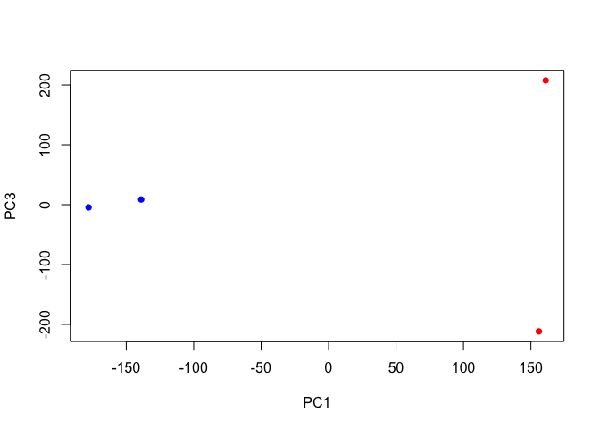
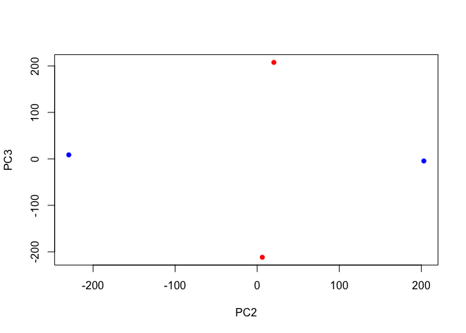
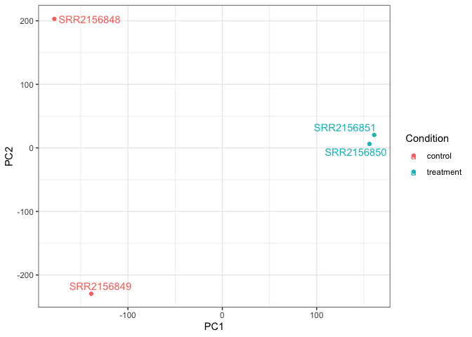
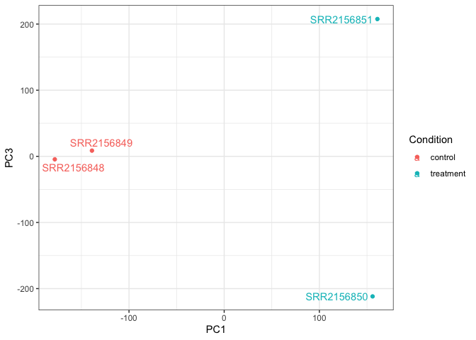
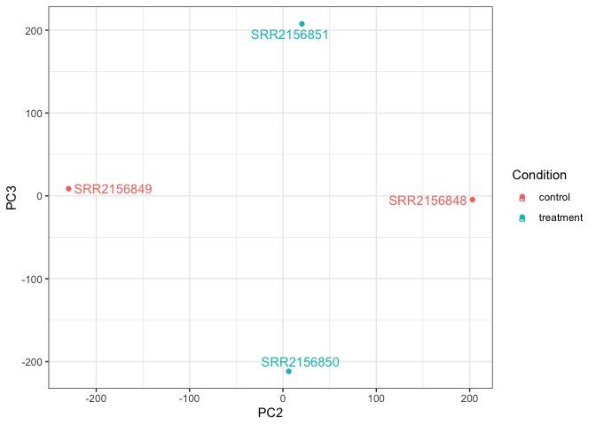

# Class 17: Analyzing sequencing data in the cloud
Linh Dang (PID: A16897764)

- [Downstream analysis](#downstream-analysis)
- [Principal Component Analysis](#principal-component-analysis)
- [Differential Expression Analysis](#differential-expression-analysis)

# Downstream analysis

Download `tximport()` in the **tximport** package to import Kallisto
results into R.

``` r
library(tximport)
```

``` r
# setup the folder and filenames to read
folders <- dir(pattern="SRR21568*")
samples <- sub("_quant", "", folders)
files <- file.path(folders, "abundance.h5" )
names(files) <- samples
```

``` r
txi.kallisto <- tximport(files, type = "kallisto", txOut = TRUE)
```

    1 2 3 4 

``` r
head(txi.kallisto$counts)
```

                    SRR2156848 SRR2156849 SRR2156850 SRR2156851
    ENST00000539570          0          0    0.00000          0
    ENST00000576455          0          0    2.62037          0
    ENST00000510508          0          0    0.00000          0
    ENST00000474471          0          1    1.00000          0
    ENST00000381700          0          0    0.00000          0
    ENST00000445946          0          0    0.00000          0

How many transcripts we have for each sample?

``` r
colSums(txi.kallisto$counts)
```

    SRR2156848 SRR2156849 SRR2156850 SRR2156851 
       2563611    2600800    2372309    2111474 

How many transcripts are detected in at least 1 sample?

``` r
sum(rowSums(txi.kallisto$counts)>0)
```

    [1] 94561

Filter out transcripts with no reads and no changes over the sample:

``` r
to.keep <- rowSums(txi.kallisto$counts) > 0
kset.nonzero <- txi.kallisto$counts[to.keep,]
keep2 <- apply(kset.nonzero,1,sd)>0
x <- kset.nonzero[keep2,]
```

# Principal Component Analysis

Perform a PCA of these samples, centering and scaling each transcript’s
measured levels so that each feature contributes equally to the PCA:

``` r
pca <- prcomp(t(x), scale=TRUE)
summary(pca)
```

    Importance of components:
                                PC1      PC2      PC3   PC4
    Standard deviation     183.6379 177.3605 171.3020 1e+00
    Proportion of Variance   0.3568   0.3328   0.3104 1e-05
    Cumulative Proportion    0.3568   0.6895   1.0000 1e+00

Plot PC1 and PC2 to visualize samples:

``` r
plot(pca$x[,1], pca$x[,2],
     col=c("blue","blue","red","red"),
     xlab="PC1", ylab="PC2", pch=16)
```


Do the same but for PC1 and PC3:

``` r
plot(pca$x[,1], pca$x[,3],
     col=c("blue","blue","red","red"),
     xlab="PC1", ylab="PC3", pch=16)
```



Do the same but for PC2 and PC3:

``` r
plot(pca$x[,2], pca$x[,3],
     col=c("blue","blue","red","red"),
     xlab="PC2", ylab="PC3", pch=16)
```



``` r
# Make metadata object for the samples
colData <- data.frame(condition = factor(rep(c("control", "treatment"), each = 2)))
rownames(colData) <- colnames(txi.kallisto$counts)

# Make the data.frame for ggplot 
y <- as.data.frame(pca$x)
y$Condition <- as.factor(colData$condition)
```

Use `ggplot()` to plot PC1 and PC2:

``` r
library(ggplot2)
library(ggrepel)
```

``` r
ggplot(y) +
  aes(PC1, PC2, col=Condition) +
  geom_point() +
  geom_text_repel(label=rownames(y)) +
  theme_bw()
```



Plot PC1 and PC3:

``` r
ggplot(y) +
  aes(PC1, PC3, col=Condition) +
  geom_point() +
  geom_text_repel(label=rownames(y)) +
  theme_bw()
```



Plot PC2 and PC3

``` r
ggplot(y) +
  aes(PC2, PC3, col=Condition) +
  geom_point() +
  geom_text_repel(label=rownames(y)) +
  theme_bw()
```



Based on the PCA, we can clearly indicate that PC1 separate differences
of the control samples from the treatment samples, while PC2 separate
the differences between the two control samples (SRR2156848 and
SRR2156849).

# Differential Expression Analysis

``` r
sampleTable <- data.frame(condition = factor(rep(c("control", "treatment"), each = 2)))
rownames(sampleTable) <- colnames(txi.kallisto$counts)
```

``` r
library(DESeq2)
```

``` r
dds <- DESeqDataSetFromTximport(txi.kallisto,
                                sampleTable, 
                                ~condition)
```

    using counts and average transcript lengths from tximport

``` r
dds <- DESeq(dds)
```

    estimating size factors

    using 'avgTxLength' from assays(dds), correcting for library size

    estimating dispersions

    gene-wise dispersion estimates

    mean-dispersion relationship

    -- note: fitType='parametric', but the dispersion trend was not well captured by the
       function: y = a/x + b, and a local regression fit was automatically substituted.
       specify fitType='local' or 'mean' to avoid this message next time.

    final dispersion estimates

    fitting model and testing

``` r
res <- results(dds)
head(res)
```

    log2 fold change (MLE): condition treatment vs control 
    Wald test p-value: condition treatment vs control 
    DataFrame with 6 rows and 6 columns
                     baseMean log2FoldChange     lfcSE      stat    pvalue
                    <numeric>      <numeric> <numeric> <numeric> <numeric>
    ENST00000539570  0.000000             NA        NA        NA        NA
    ENST00000576455  0.761453       3.155061   4.86052 0.6491203  0.516261
    ENST00000510508  0.000000             NA        NA        NA        NA
    ENST00000474471  0.484938       0.181923   4.24871 0.0428185  0.965846
    ENST00000381700  0.000000             NA        NA        NA        NA
    ENST00000445946  0.000000             NA        NA        NA        NA
                         padj
                    <numeric>
    ENST00000539570        NA
    ENST00000576455        NA
    ENST00000510508        NA
    ENST00000474471        NA
    ENST00000381700        NA
    ENST00000445946        NA
